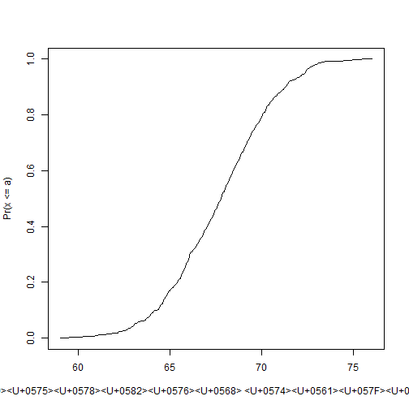

```r
getOption("encoding")
```

```
## [1] "native.enc"
```


### Introduction


```r
dat = read.csv("femaleMiceWeights.csv")
head(dat)
```

```
##   Diet Bodyweight
## 1 chow      21.51
## 2 chow      28.14
## 3 chow      24.04
## 4 chow      23.45
## 5 chow      23.68
## 6 chow      19.79
```

```r
View(dat)
```


```r
library(dplyr)

control = filter(dat, Diet == "chow") %>% select(Bodyweight) %>% unlist
```

```
## Error in select(., Bodyweight): unused argument (Bodyweight)
```

```r
treatment = filter(dat, Diet == "hf") %>% select(Bodyweight) %>% unlist
```

```
## Error in select(., Bodyweight): unused argument (Bodyweight)
```

```r
mean(treatment)
```

```
## [1] 22.82167
```

```r
mean(control)
```

```
## [1] 25.11
```

```r
obsdiff = mean(treatment)-mean(control)
print(obsdiff)
```

```
## [1] -2.288333
```
These averages are in reality **random variables**, as they can take many values every time we repeat the experiment.

### Random Variables


```r
library(downloader)

url <- "https://raw.githubusercontent.com/genomicsclass/dagdata/master/inst/extdata/femaleControlsPopulation.csv"
filename <- "femaleControlsPopulation.csv"

if (!file.exists(filename)) download(url, destfile = filename) #downloading neede file if it is not there in our working directory

population <- read.csv(filename)

population <- unlist(population) # turn it into a numeric
```


See the random means

```r
sample(population,12) %>% mean
```

```
## [1] 23.24167
```

```r
sample(population,12) %>% mean
```

```
## [1] 24.46333
```

```r
sample(population,12) %>% mean
```

```
## [1] 23.65667
```
### The Null Hypothesis


```r
n = 10000
null = vector("numeric", n)

for (i in 1:n) {
  control = sample(population, 12)
  treatment = sample(population, 12)
  null[i] = mean(treatment) - mean(control)
}
```

Values in `null` form the **null distribution**


How many / what percent of the null distribution values are greater than the difference we observed between actual treatment and control groups?


```r
mean(null >= obsdiff)
```

```
## [1] 0.9571
```
In other words, what is the probability that there would be a _greater (or equal) difference_ if the treatment had no effect? This is the **p-value**!


### Distributions

_Distribution_ could be described as a compact description of many numbers.

Say we have hights of 1078 fathers:


```r
library(UsingR)
x <- father.son$fheight


round(sample(x, 10), 1) #see what some of the numbers look like
```

```
##  [1] 68.2 64.0 67.1 66.5 66.6 71.1 67.0 64.3 65.3 68.1
```
Not an efficient way. How to have a more clear idea of what all the numbers look like?

We can **_define_** and **_visualize a distribution_**.

#### Cumulative distribution function (CDF)

$F(a) ≡ Pr(x \le a)$  

Percent of values of the data set that are below each $a$.

CDF - theoretical
ECDF - empirical CDF, if derived from empirical data

How to see it in action: by plotting.


```r
smallest = floor(min(x))
largest = ceiling(max(x))

values = seq(smallest, largest, len = 300) #these are the a-s

heightecdf = ecdf(x)
percents = heightecdf(values)

plot(values, percents, 
     type = "l",
     xlab = "a (բարձրությունը մատնաչափերով)",
     ylab = "Pr(x <= a)"
     )
```




### TODO

Create a GitHub repository and place all the notes there


2. https://resources.github.com/github-and-rstudio/


